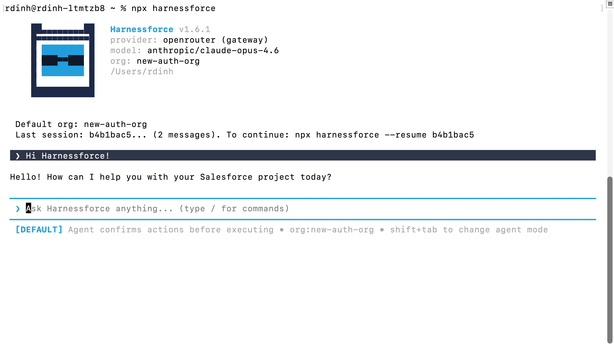

# Harnessforce

<p align="center">
  
</p>

<p align="center">
  <strong>An open-source AI agent for Salesforce development</strong><br/>
  Admin work, Apex, LWC, Agentforce, Data Cloud, custom apps -- all from your terminal.
</p>

<p align="center">
  
</p>

---

## What is Harnessforce?

Harnessforce is an AI agent that works directly on the Salesforce platform. It reads your project, connects to your org, and does real work -- writing Apex, deploying metadata, building Agentforce agents, querying Data Cloud, automating Setup pages, and more.

It ships with 59 tools, 27 skills, and 84 slash commands. You describe what you want. It plans the approach, writes the code, deploys it, and verifies it works.

**Open source. Model agnostic. Built for Salesforce developers who want to move fast.**

## Getting Started

```bash
npx harnessforce
```

This always runs the latest version. On first launch, Harnessforce shows you what's needed to get going. Set your API key:

```
/set-key sk-or-your-key-here
```

Get a key at [openrouter.ai/keys](https://openrouter.ai/keys) -- one key gives you access to Claude, GPT, Gemini, and 200+ models.

Then connect a Salesforce org:

```bash
sf org login web
```

Harnessforce auto-detects authenticated orgs on startup.

## Model Setup

Harnessforce shows your active provider and model in the startup greeting. If anything is missing, it tells you exactly what to do next.

### Switch Models

Any model name works -- not just the ones in the built-in list:

```
/model openai/gpt-5.4
/model deepseek/deepseek-v3.2
/model anthropic/claude-haiku-4
```

### Local Models (Ollama)

```
/provider local
/model llama3:latest
```

No API key needed -- just have Ollama running (`ollama serve`).

### Other Providers

```
/provider add anthropic https://api.anthropic.com/v1 sk-ant-...
/model anthropic:claude-opus-4.6
```

The provider type (cloud/local/gateway) is auto-detected from the URL.

### Provider Management

```
/provider            show current setup + what's missing
/provider list       list all configured providers
/provider local      switch to Ollama
/provider openrouter switch to OpenRouter
/provider add <name> <url> [api-key]
/provider remove <name>
```

## How It Works

### Agent Architecture

Built on [LangGraph](https://github.com/langchain-ai/langgraphjs) with a ReAct (Reason + Act) loop. The agent receives your message, reasons about what tools to use, executes them, observes the results, and iterates until the task is complete.

```
User message
  -> LLM reasoning (plan the approach)
    -> Tool execution (read files, run sf commands, write code)
      -> Observe results
        -> Continue or respond
```

A MemorySaver checkpointer preserves full conversation state across turns. Resume any previous session with `npx harnessforce --resume <id>`.

### Write Code, Not Tools

Instead of needing a dedicated tool for every Salesforce operation, Harnessforce writes source files -- Apex classes, Flow XML, LWC components, `.agent` bundles, permission sets -- and deploys them via the `sf` CLI, exactly like a developer would.

This means it can handle any of Salesforce's 470+ metadata types out of the box, even ones it hasn't encountered before.

### Context Intelligence

On startup, Harnessforce scans your project directory. It detects Apex classes, LWC components, Flows, Agentforce agents, your default org, and git state. Based on what it finds, it injects only the relevant Salesforce knowledge into context -- governor limits, trigger patterns, testing strategies, deployment best practices -- so the agent has platform expertise without wasting tokens.

### Automation Layers

1. **SF CLI + Metadata API** -- The primary path. Write source files and deploy them.
2. **Playwright browser automation** -- For Setup pages and UI-only operations that have no API equivalent. 6 browser tools handle navigation, clicking, filling forms, screenshots, and JS execution.

### FORCE.md

Like CLAUDE.md for Claude Code, FORCE.md files tell Harnessforce how to work in your project. Three layers merge together:

- `FORCE.md` in your project root (team conventions)
- `~/.harnessforce/FORCE.md` (personal preferences)
- `FORCE.local.md` (private overrides, gitignored)

### Permission Modes

Harnessforce starts in **plan mode** -- it presents a plan before executing anything. After the first turn, it switches to **default mode** where it executes but confirms destructive operations. Press **Shift+Tab** to cycle to **yolo mode** for full auto-approval.

### Skills

Skills are markdown files that teach the agent specialized workflows. Harnessforce ships with 27 covering Agentforce development (full ADLC lifecycle), test automation, CI/CD pipelines, data migration, security hardening, package development, and more.

Create new skills with `/skill-add <name>` or let the agent create them when it learns something new.

### Memory

The agent persists learnings to `.harnessforce/agent.md` and reads them back on every turn. It remembers your org's quirks, your preferred patterns, and solutions from previous sessions. On session end, it auto-extracts key learnings.

## Tools (59)

| Category | Count | Examples |
|----------|-------|---------|
| Core filesystem | 8 | read_file, write_file, edit_file, execute, glob, grep |
| Salesforce CLI | 12 | sf_query, sf_deploy, sf_retrieve, sf_run_tests, sf_run_apex |
| Metadata discovery | 3 | sf_list_metadata_types, sf_describe_all_sobjects |
| Extended Salesforce | 12 | sf_scratch_org_create, sf_package_create, sf_test_coverage, sf_data_export |
| Docs | 2 | sf_docs_search, sf_docs_read |
| Browser automation | 6 | browser_open, browser_click, browser_fill, browser_screenshot |
| Agentforce | 4 | agent_publish, agent_activate, agent_validate, agent_preview |
| Data Cloud | 7 | dc_query, dc_list_objects, dc_ingest_streaming, dc_create_segment |
| Web | 2 | web_search, web_fetch |
| Planning & knowledge | 3 | write_todos, sf_knowledge, agent_spawn |

## What Can It Do?

**Salesforce Admin** -- Create custom objects and fields, configure sharing rules, manage profiles and permission sets, set up org features, query data with SOQL.

**Apex & LWC Development** -- Write triggers with tests, build Lightning Web Components, analyze governor limit risks, generate test classes, debug deployment failures.

**Agentforce** -- Design agent personas, write Agent Script (`.agent` files), scaffold Apex actions and Flow XML, deploy bundles, test with structured utterances, analyze session traces.

**Data Cloud** -- Query Data Model Objects, set up identity resolution, create segments, stream or bulk ingest data.

**DevOps** -- Create and manage scratch orgs, build packages, run test suites with coverage analysis, set up CI/CD pipelines, manage sandbox lifecycles.

**Custom Apps** -- Scaffold apps with Salesforce integration. Deploy to Heroku. Set up Connected Apps with OAuth.

## Slash Commands

84 built-in commands plus 27 skill commands. Type `/` to see the full list. Some highlights:

```
/model <name>        switch models
/provider            manage providers
/set-key <key>       save API key
/org <alias>         switch orgs
/deploy              deploy metadata
/test                run tests
/query <soql>        run SOQL
/cost                show token usage
/compact             free up context
/threads             list sessions
/resume <id>         resume a session
/skill-list          list skills
/help                see all commands
```

## Development

```bash
git clone https://github.com/skyrmionz/harnessforce.git
cd harnessforce
pnpm install
pnpm build
node apps/cli/dist/index.js
```

The project is a pnpm monorepo with two packages:

- `libs/harnessforce` -- Core agent library (`harnessforce-core` on npm)
- `apps/cli` -- Terminal UI (`harnessforce` on npm)

## License

MIT
